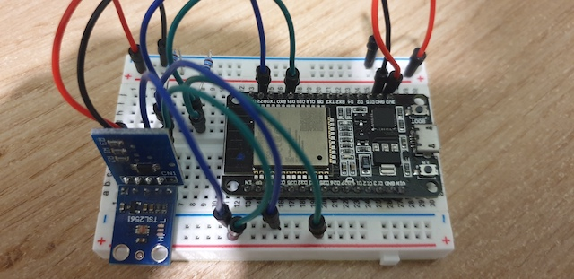

# MQTT INFLUXDB GRAFANA DOCKER ESP32

Project IOT : setting up a MQTT server, with InfluxDB database. Displayed with Grafana, everything is launched by a docker-compose.

An ESP32 is used with two I2C sensors : a temperature sensor (MCP9808) and a light sensor (TSL2561). 

He publishes in " sensors/kerno/bedroom/temperature " and " sensors/kerno/bedroom/luminosity " in JSON format. The data is saved in InfluxDB v1.8 (local database) and InfluxDB v2 (cloud database). Both databases can be visualized in Grafana.

Run in Mac OS and Raspberry pi OS.

<p align="center">
    
</p>

## Command to run service

```
/path/docker-compose up
```

## Command to execute influxdb cli

```
docker exec -it influxdb influx
```

MAC OS :don't forget to allow the path in docker.
